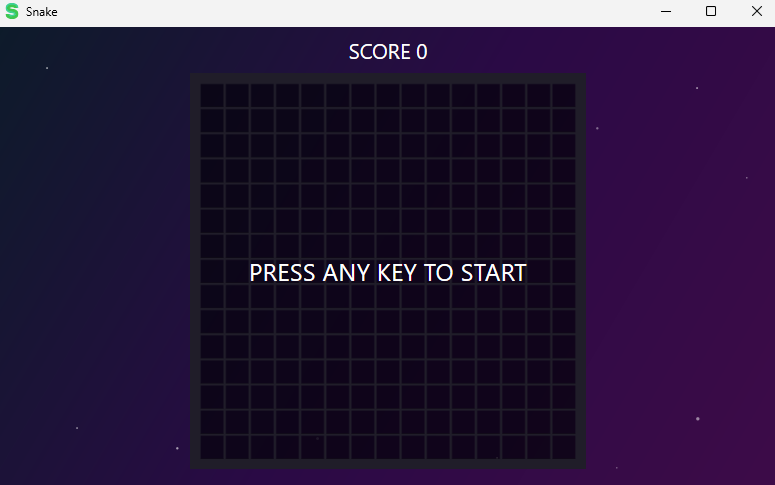
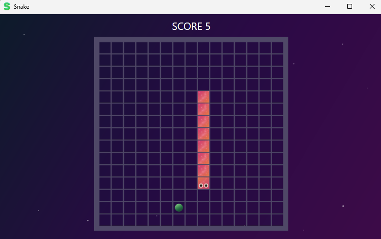
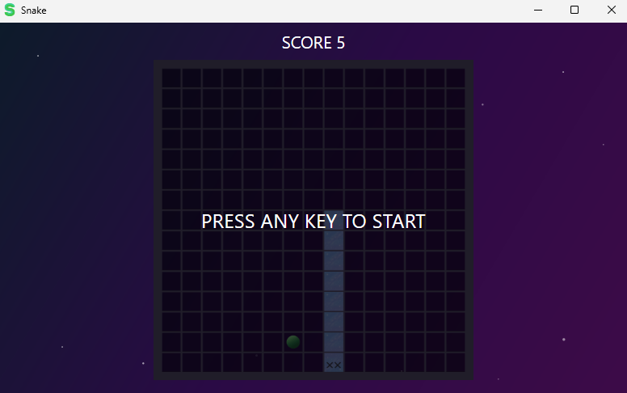

<h1 align="center">🌌 Jogo Snake no Espaço 🌌</h1>

<p align="center">Uma versão cósmica do clássico jogo da cobrinha, feita em C# com WPF e Console!</p>

---

## 🚀 Como jogar

- 🕹️ Use as setas do teclado para controlar a cobra.
- 🍎 Coma a comida para crescer.
- 💥 Evite colidir com as paredes e consigo mesmo.

---

## 🌟 Prints do Jogo

<p align="center">
  
   <br/>
  
  <br/>
  
   <br/>
  
   <br/>
</p>

---

## 🧪 Tecnologias usadas

- 🧠 **Linguagem:** C#
- 💻 **Interface:** Console e WPF

---

## 🛰️ Como rodar o jogo

1. Clone o repositório:
   ```bash
   git clone https://github.com/seu-usuario/seu-repositorio.git
